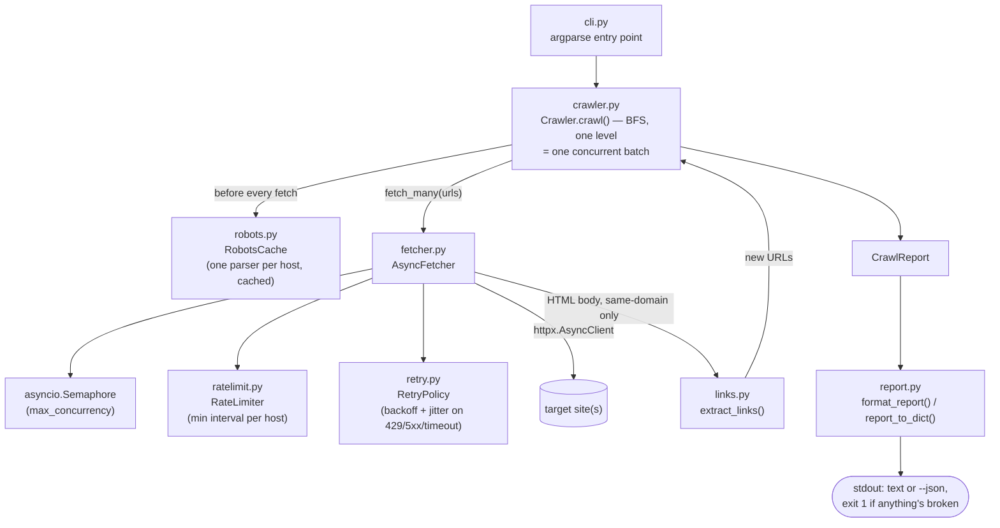

# Async Crawler

> Async web scraper and link checker with rate limiting, exponential backoff, and robots.txt compliance

[](https://github.com/Prithv122/async-crawler/actions/workflows/ci.yml)

**Live demo:** not deployed — runs locally, or as a CI step in any project
**Stack:** Python 3.13, `httpx` (async HTTP), stdlib `asyncio` / `urllib.robotparser` / `html.parser` / `argparse`

---

## 1. The problem

Every site accumulates dead links: pages get renamed, external sites go down, a migration misses
a redirect. Finding them by hand doesn't scale past a handful of pages, and a naive crawl-every-link
script either runs so slowly it's useless on a real site, or runs so aggressively it looks like an
attack to the site it's checking. This is a link checker built to do both at once: crawl a site
concurrently enough to finish in seconds, while staying inside `robots.txt`, a per-host rate limit,
and backoff on any server that asks it to slow down — so it's safe to point at someone else's site,
including your own production one, and safe to drop into a CI pipeline as a link-check gate (it
exits non-zero when it finds a broken link).

## 2. The data

| | |
|---|---|
| Source | Whatever site is passed as the seed URL at runtime — no bundled dataset |
| Size | N/A — one HTTP request per discovered link, up to `--max-pages` same-domain pages |
| Licence | N/A |
| Refresh | Live, on every run |

There's no dataset to ship. The **Results** numbers below come from
[`scripts/demo.py`](scripts/demo.py), a small self-contained local site (two Python
`http.server` instances, no real network traffic) built specifically so those numbers are
reproducible on any machine and don't depend on a third-party site staying reachable, or on
hammering someone else's server repeatedly just to benchmark against it.

## 3. Architecture



## 4. Key decisions & tradeoffs

| Decision | Chose | Over | Why |
|---|---|---|---|
| robots.txt fetching | Fetch via the shared async `httpx` client, feed the body to `RobotFileParser.parse()` | `RobotFileParser.read()` | `.read()` does a blocking `urlopen()`, which would stall the event loop for every host on first contact |
| robots.txt on error | Fail **closed** (disallow) on 401/403/5xx/network errors; fail **open** (no restriction) only on 404/other 4xx | Fail-open on any fetch problem | Per RFC 9309 convention: "confirmed absent" and "unreachable for an unknown reason" aren't the same thing, and only the first justifies assuming no restrictions |
| Link status check | Always `GET` | `HEAD`-first with `GET` fallback | Many real servers respond incorrectly (or not at all) to `HEAD`; `GET` is heavier but the status it reports is trustworthy — the whole point of a link *checker* |
| Response body buffering | Decode `.text` only when `Content-Type` contains `html` | Always decode | A crawler that buffers every response body risks holding a large binary file (image, PDF, video) in memory for a URL it was only ever going to status-check |
| `max_pages` budget | Counts every same-domain URL actually **fetched**, including ones that 404 | Count only pages successfully parsed for more links | It's a safety cap on crawl activity, not a claim that everything it touched was useful — a broken internal link still cost a request |
| CLI framework | stdlib `argparse` | `Typer`/`Rich` (used in [ledger-cli](../03-ledger-cli)) | This project's interesting engineering is the async engine, not the CLI; no dependency was worth adding just to format one summary report |

Full rationale — including two things that looked like bugs during testing but turned out to be
correct stdlib/Python behavior — is in [`NOTES.md`](NOTES.md).

## 5. Results

All numbers below are from an actual run of `uv run python scripts/demo.py` against the local
fixture site described above (5 same-domain pages, 20 simulated external links each with an
artificial 150 ms delay, one endpoint that fails twice before succeeding, one page disallowed by
robots.txt, one broken link). Timings will vary a little by machine; the shape of the result
(large speedup from concurrency, retries actually firing, robots.txt actually enforced) is the
point, not the exact millisecond.

| Metric | Value | Notes |
|---|---|---|
| Pages crawled | 5 | Same-domain pages actually fetched |
| Links checked | 25 | Internal + external, deduplicated |
| Broken links found | 1 | The deliberately-404 fixture page |
| Skipped by robots.txt | 1 | The deliberately-disallowed fixture page — never requested |
| `/flaky` endpoint requests | 3 | 2 failures (503) + 1 success — proves the retry/backoff loop actually ran, not just the happy path |
| Crawl time, `--max-concurrency 1` | 3.4s | Same site, same 20×150ms external links, fetched one at a time |
| Crawl time, `--max-concurrency 10` (default) | 0.64s | **~5.3× faster** — the semaphore-bounded concurrency is a real, measured effect, not a claim |
| Tests | 82 passed | `uv run pytest` |
| Coverage | 100% | `uv run pytest --cov=src` |

The concurrency speedup (~5.3×) is lower than the naive "10 concurrent slots ÷ 1 concurrent slot
= 10×" estimate, because 20 requests through 10 slots takes 2 waves (~300ms of pure delay) plus
real overhead (connection setup, event loop scheduling, the sequential internal pages fetched in
earlier BFS levels) — reporting the measured number rather than the theoretical one is the
honest version of this result.

## 6. How to run

```bash
git clone https://github.com/Prithv122/async-crawler.git
cd async-crawler
uv sync
uv run pytest --cov=src --cov-report=term-missing
```

No environment variables, accounts, or external services are required — see
[`.env.example`](.env.example).

Crawl a real site:

```bash
uv run async-crawler https://example.com/ --max-pages 20
```

Reproduce the numbers in **Results**, entirely locally:

```bash
uv run python scripts/demo.py
```

Useful flags (`uv run async-crawler --help` for the full list):

```bash
uv run async-crawler https://example.com/ \
    --max-pages 20 \
    --max-concurrency 10 \
    --rate-limit 1.0 \
    --max-retries 3 \
    --json                # machine-readable output
    # --ignore-robots      # off by default; opt in explicitly
```

Exit code is `0` if every checked link was fine, `1` if any were broken — safe to use as a CI
step (`uv run async-crawler https://your-site.example/ || exit 1`).

## 7. What I'd change at 100× scale

- **Frontier state**: the crawl frontier is an in-memory list inside one `asyncio` event loop —
  fine for the tens-to-low-hundreds of pages this is scoped for, but it caps out at whatever one
  process's memory and one machine's network stack can do. At 100×, that becomes a durable queue
  (Redis/SQS) so multiple worker processes (or machines) can pull from the same frontier, with a
  shared `RateLimiter` (Redis-backed token bucket keyed by host) so politeness holds across
  workers, not just within one.
- **Link checking strategy**: `GET`-always is correct but heavy. At scale, I'd add a `HEAD`-first
  path with a `GET` fallback only when `HEAD` is disallowed (405) or the response looks
  suspicious, to cut bandwidth on the (usually large majority of) links that are just fine.
  Deferred deliberately here — see the decisions table.
- **Resumability**: a crawl that dies at page 8,000 of 10,000 currently restarts from zero. I'd
  persist `CrawlReport` incrementally (not just at the end) so a crash or a scheduled interruption
  can resume instead of re-fetching everything.
- **Discovery beyond `<a href>`**: real sites also link through `sitemap.xml`, `<link>` tags, and
  JS-rendered navigation. A production crawler would parse sitemaps as an additional seed source
  and, for JS-heavy sites, optionally hand off to a headless browser for a subset of pages — at
  real cost, so it should be opt-in, not default.
- **Observability**: right now a crawl either finishes and prints a report, or you wait. At scale
  I'd add structured logging and live progress (pages/sec, current queue depth, error rate) so a
  crawl of hours, not seconds, is debuggable while it's still running.

---

## References

- [RFC 9309 — Robots Exclusion Protocol](https://www.rfc-editor.org/rfc/rfc9309.html) — informed
  the fail-closed-on-401/403/5xx, fail-open-on-404 policy in `robots.py`
- Python stdlib docs for [`urllib.robotparser`](https://docs.python.org/3/library/urllib.robotparser.html)
  and [`html.parser`](https://docs.python.org/3/library/html.parser.html)
- [httpx documentation](https://www.python-httpx.org/) — async client, `AsyncBaseTransport` used
  throughout the test suite to mock HTTP without real network calls
